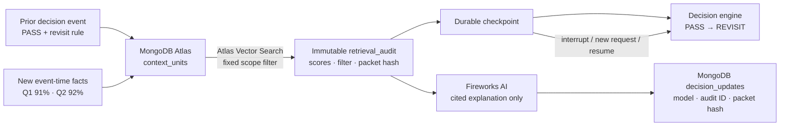

# VSee Context Loop

> The agent that knows when your “No” is outdated.

VSee gives venture teams a durable context loop. It remembers why a deal was passed, retrieves only the active memory for that fund and company when new evidence arrives, checkpoints the evidence packet, and changes the next action when the stored revisit condition becomes true.

## Hackathon provenance

This repository is a **new, event-time implementation created during the MongoDB Persistent Context Sprint Hackathon on 13 August 2026**. An older VSee/XTrace prototype helped identify the user problem, but no prior application code or MongoDB integration was copied here. The public commit history starts with the untouched Sites starter and separates the domain, persistence, review remediation, visual asset, interface, and release work.

## The 60-second story

- **Then:** Irregular was passed on 10 Nov 2025 at 78% net retention. The stored condition said: revisit after two quarters above 90%.
- **Now:** A confirmed update records Q1 at 91% and Q2 at 92%.
- **Context loop:** MongoDB retrieves the prior decision and both event-time facts using a fixed `workspaceId + dealId + active` boundary, then persists the scored evidence packet and checkpoint before reasoning.
- **Next:** The action changes from `PASS` to `REVISIT` and proposes a partner meeting.
- **Crash proof:** Interrupt after retrieval, start a new request, and resume from the same stored audit ID—without retrieving again.

This is not basic RAG. Stored context is causally responsible for the action, and the retrieval/checkpoint is an inspectable product surface rather than hidden prompt stuffing.

## MongoDB is the context plane



Core MongoDB features:

- organizer-provided Atlas Sandbox as the system of record;
- Automated Embedding on `context_units.text` using MongoDB-managed `voyage-4`;
- Atlas Vector Search index `context_vector_v1` with prefilters for `workspaceId`, `dealId`, `active`, `kind`, and `eventTime`;
- durable `agent_runs` and immutable `retrieval_audits` with idempotency indexes;
- truthful scoped cosine fallback while the asynchronous Atlas index is building;
- request-scoped MongoDB clients for Cloudflare Worker lifecycle safety.

Fireworks AI is a deliberately downstream partner layer. After a run completes, it receives only the persisted immutable audit and may select exact evidence IDs plus one server-approved diligence action. The server renders the final cited prose exclusively from stored candidate text, then writes it back to MongoDB with the provider, model, audit ID, and packet hash. Unknown IDs, invented prose, and decision-like actions cannot enter the memo. A MongoDB generation lease prevents concurrent fan-out, and a fixed-scope hourly quota caps public provider calls. Fireworks can organize the explanation; it cannot change `PASS` or `REVISIT`.

The interface says `ATLAS VECTOR SEARCH` only when Atlas reports the index queryable. A MongoDB round trip with a building index is labelled `MONGODB SCOPED FALLBACK`; the deterministic fixture is labelled `DEMO FIXTURE`.

## Run locally

Requirements: Node.js `>=22.13.0` and access to a MongoDB Atlas deployment. An active Fireworks API key is optional for the cited partner memo; the core context loop does not depend on it.

```bash
npm ci
cp .env.example .env.local
# Fill only the server-side values in .env.local.
npm run atlas:bootstrap
npm run dev
```

Open `http://localhost:3000`.

Verification:

```bash
npm run typecheck
npm run lint
npm run test:unit
npm run build
npm run test:render
```

`scripts/bootstrap-atlas.mjs` is idempotent: it creates the demo collection before inspecting search indexes, upserts exactly the fixed synthetic prior decision and Q1/Q2 facts, creates the search index when absent, and clears only the fixed demo scope's run artifacts. It never prints credentials.

## Public API contract

| Route | Purpose |
| --- | --- |
| `GET /api/demo` | Current persisted Then / Now / Next projection and retrieval state |
| `POST /api/demo/reset` | Restore only the fixed synthetic scope |
| `POST /api/demo/run` | Run the context loop with an `Idempotency-Key` |
| `POST /api/demo/interrupt` | Persist retrieval audit/checkpoint, then stop |
| `POST /api/demo/resume` | Resume using only `{ "runId": "…" }` |
| `POST /api/demo/explain` | Ask Fireworks for a cited memo from a completed immutable audit, then persist it to MongoDB |

Public mutations cannot select arbitrary databases, collections, workspaces, deals, or queries. API errors are sanitized. Credentials, provider prompts, and unrestricted driver errors never reach the browser.

## Design choices

- **Deterministic decision, semantic retrieval.** The belief change is a typed rule over cited facts, so an LLM outage cannot fabricate the result. MongoDB decides which stored facts enter the packet.
- **Audit before action.** The retrieval packet—candidate snapshots, scores, fixed filter, mode, packet hash, and checkpoint—is durable before a run is exposed.
- **Replay, not recomputation.** Resume derives from the stored audit candidates. It does not call retrieval again.
- **Hard isolation.** Every live query includes `demo_fund`, `deal_irregular`, and `active: true` on the server.
- **Honest degradation.** Atlas index readiness, MongoDB fallback, and fixture mode are different explicit states.
- **Partner model is not the judge.** Fireworks writes a cited explanation from the completed packet. Provider failure returns a sanitized unavailable state while the MongoDB-backed decision remains intact.

## Security and demo operations

- `.env*` is ignored; `.env.example` contains placeholders only.
- The Atlas application user has read/write access rather than Atlas administration rights.
- The temporary `0.0.0.0/0` Atlas network entry is for the short-lived serverless hackathon deployment and must be removed after judging.
- All demo data is synthetic. Do not upload confidential founder, customer, or investment data.
- Reset is intentionally limited to one public synthetic scope. Production would add per-session isolation, durable rate limiting, and a non-destructive generation pointer.

See [docs/demo-runbook.md](docs/demo-runbook.md) for the one-minute video, three-minute stage flow, verification checklist, and failure fallbacks.

## Repository and license

Public source: [github.com/ryanwu1008/vsee-belief-reversal](https://github.com/ryanwu1008/vsee-belief-reversal)

Built solo during the event by Ryan Wu with Codex as an implementation tool. Third-party packages retain their respective licenses.
